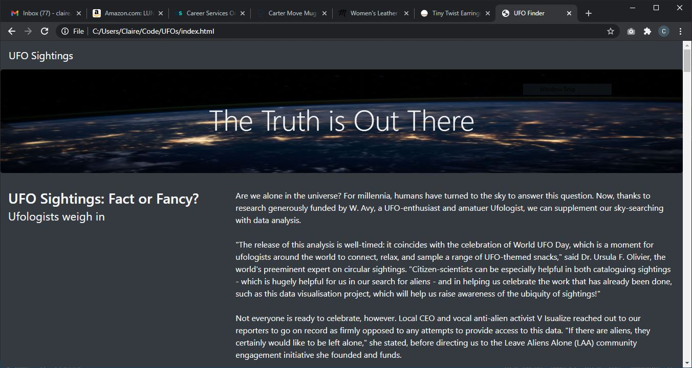
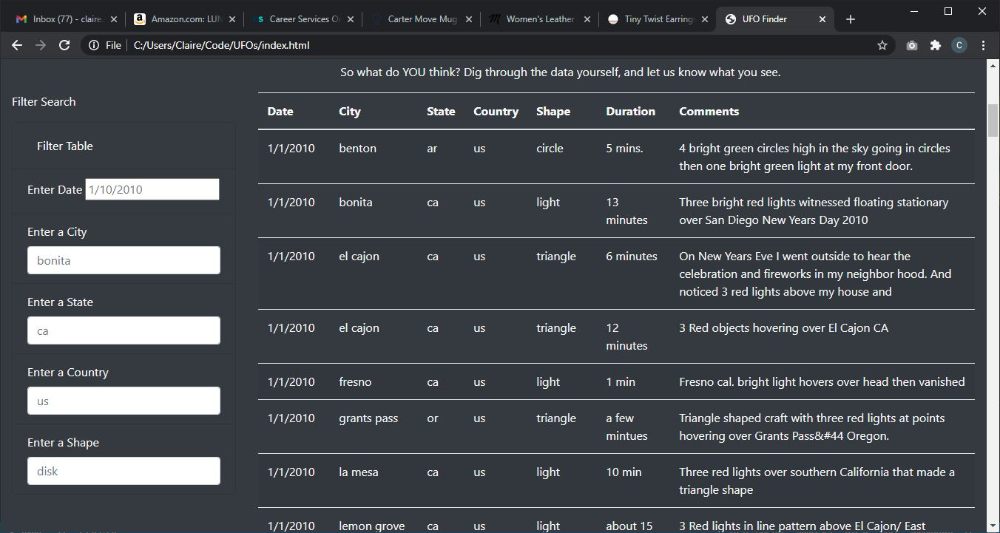
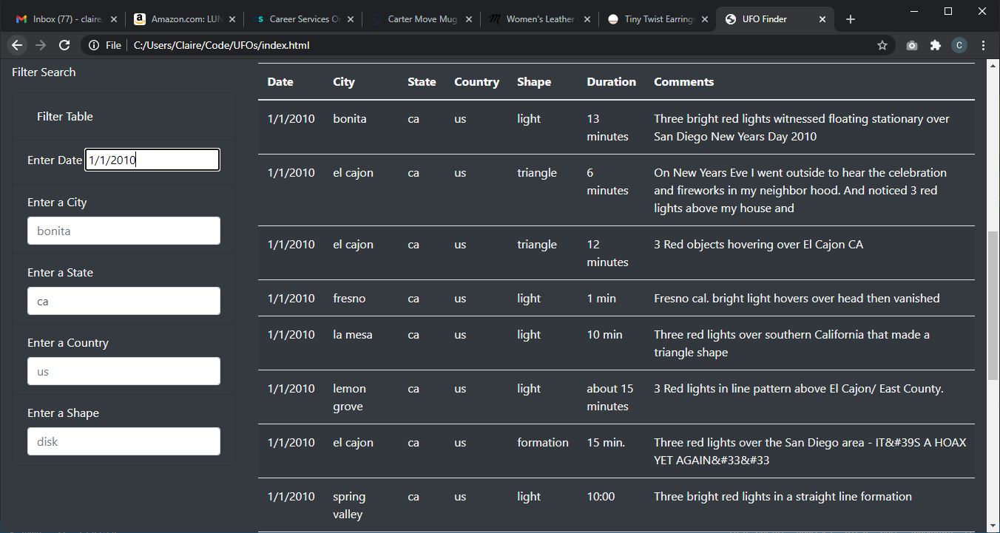

# UFOs
mod 11 challenge javascript and html
## Overview of Project - purpose of analysis
During this lesson I learned how to create a website that includes a table of UFO sightings made with javascript. In the lesson, our table had a filter on date. During this analysis I added more filters for city, state, country, and shape of UFO. Now you can filter on any number of these things and the table will return filtered.

## Results - 
Describe to Dana how someone might use the new webpage by walking her through the process of using the search criteria. Use images of your webpage during the filtering process to support your explanation.

When you first open the webpage, you should see an image similar to the one below. The page contains some information about potential UFO sightings and a word from UFO experts.

When you scroll down on the webpage you will see something similar to the image below with filter options on the left, and an unfiltered tale on the right. The table has a row for each UFO sighting reported, and some information about each one. If you want to see information for a specific date, city, state, country, or shape of UFO, you can put in those parameters and click the Filter Table button.

As an example shown below, I have entered "ca" for California as the state as well as 1/1/2010 for the date. You can see that the table is now filtered to only show sightings with these parameters.

## Summary
 In a summary statement, describe one drawback of this new design and two recommendations for further development.

 One drawback of this design is that you can't tell which cities, state, countries, shapes, and dates we have data for. You may enter a city that has no sighting information. To fix this, I would recommend making a drop down menu for the filters so you can select only from available options, instead of letting users type in their own parameters. This will also avoid the issue of users accidentally inputting information in the wrong format. 

 Second, I would recommend working with the data.js file to clean up some of the data. I would capitalize the names of cities, states, and countries and fix the inconsistent formatting for the duration and comment sections. 